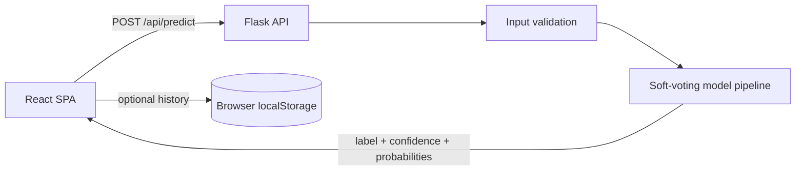

<div align="center">

# MindCare

**A privacy-first mental wellness screening experience for students.**

[](https://github.com/letera1/Mental-Health-Stress-Predictor/actions/workflows/ci.yml)
[](https://hub.docker.com/r/tuta699/mental-health-stress-detector)
[](CHANGELOG.md)
[](LICENSE)

[Get started](#quick-start) | [Architecture](docs/ARCHITECTURE.md) | [API](backend/docs/API.md) | [Docker](docs/DEPLOYMENT.md) | [Contributing](CONTRIBUTING.md)

</div>

> [!IMPORTANT]
> MindCare is an educational screening aid, not a medical device, diagnosis, or
> substitute for professional care. If someone is in immediate danger, call
> emergency services. In the United States, call or text **988**.

## Overview

MindCare combines a responsive React interface with a Flask inference API and a
soft-voting scikit-learn ensemble. A ten-field assessment returns a risk label,
model confidence, class probabilities, practical next steps, and links to
trusted support resources.

The API is stateless. Assessment history is optional and stays in the browser's
local storage; it is never persisted by the server.

## Highlights

- **Private by design** - no accounts, tracking, or server-side assessment history.
- **Validated inference contract** - strict types, categories, and training-range bounds.
- **Transparent results** - class label, confidence, and probability distribution.
- **Real dashboard data** - trends are built from assessments on the current device.
- **Accessible responsive UI** - phone, tablet, desktop, light/dark themes, keyboard navigation.
- **Production container** - multi-stage build, non-root runtime, Gunicorn, health checks.
- **Automated quality gates** - Ruff, Pytest, ESLint, npm audit, Vite build, and Docker build.

## Technology

| Layer | Technology |
| --- | --- |
| Frontend | React 19, Vite 7, Tailwind CSS 4, Recharts |
| Backend | Python 3.11, Flask 3, Gunicorn |
| Machine learning | scikit-learn 1.6, pandas, joblib |
| Testing and linting | Pytest, Ruff, ESLint |
| Delivery | Docker, Docker Compose, GitHub Actions, Dependabot |

## Architecture



The production image serves the built SPA and API from the same Flask/Gunicorn
origin. See [docs/ARCHITECTURE.md](docs/ARCHITECTURE.md) for boundaries and data flow.

## Repository layout

```text
.
|-- .github/
|   |-- workflows/              CI and Docker publishing
|   |-- ISSUE_TEMPLATE/         structured issue forms
|   `-- dependabot.yml          dependency update policy
|-- backend/
|   |-- mindcare/               Flask package
|   |   |-- config.py           paths and environment defaults
|   |   |-- inference.py        model loading and prediction
|   |   |-- routes.py           API and SPA routes
|   |   `-- schema.py           request validation
|   |-- models/                 serialized model artifacts
|   |-- tests/                  API and schema tests
|   |-- notebooks/              offline research and training
|   |-- app.py                  local/Gunicorn entry point
|   `-- requirements*.txt       runtime and development dependencies
|-- frontend/
|   |-- src/
|   |   |-- app/                router and application shell
|   |   |-- components/         reusable assessment, layout, and UI components
|   |   |-- pages/              lazy-loaded route pages
|   |   |-- providers/          theme provider
|   |   |-- lib/                domain and browser-storage helpers
|   |   `-- styles/             Tailwind entry point and theme tokens
|   `-- package.json
|-- docs/                       architecture, development, deployment
|-- scripts/                    local check, dev, and release automation
|-- Dockerfile
|-- docker-compose.yml
|-- pyproject.toml
`-- VERSION
```

## Quick start

### Requirements

- Python 3.11 or newer
- Node.js 22 or newer
- npm 10 or newer

### Install

```powershell
+git clone https://github.com/letera1/Mental-Health-Stress-Predictor.git
+cd Mental-Health-Stress-Predictor
+
+python -m venv .venv
+.\.venv\Scripts\python.exe -m pip install -r backend\requirements-dev.txt
+
+cd frontend
+npm ci
+cd ..
```

### Run

```powershell
+.\scripts\dev.ps1
```

Or start each service manually:

```powershell
+# terminal 1
+cd backend
+..\.venv\Scripts\python.exe app.py
+
+# terminal 2
+cd frontend
+npm run dev
```

| Service | URL |
| --- | --- |
| Frontend | <http://localhost:5173> |
| API | <http://127.0.0.1:5001> |
| Health check | <http://127.0.0.1:5001/health> |

This backend uses **Flask**, not FastAPI. Do not start it with Uvicorn.

## API example

```http
POST /api/predict
Content-Type: application/json
```

```json
{
  "Age": 21,
  "Gender": "Female",
  "GPA": 3.2,
  "Stress_Level": 4,
  "Anxiety_Score": 14,
  "Depression_Score": 16,
  "Sleep_Hours": 5.5,
  "Steps_Per_Day": 4200,
  "Mood_Description": "Anxious",
  "Sentiment_Score": -0.4
}
```

```json
{
  "prediction": 2,
  "label": "Struggling",
  "confidence": 0.7961,
  "probabilities": {
    "Healthy": 0.0043,
    "At Risk": 0.1996,
    "Struggling": 0.7961
  }
}
```

The full contract and error responses are documented in [backend/docs/API.md](backend/docs/API.md).

## Quality checks

Run the complete local gate:

```powershell
+.\scripts\check.ps1
```

It runs:

1. Ruff application lint.
2. Pytest backend tests.
3. ESLint frontend lint.
4. npm production dependency audit.
5. Vite production build.

GitHub Actions also builds the Docker image after both application jobs pass.

## Docker

```powershell
+# Build versioned and latest tags
+.\scripts\docker-release.ps1
+
+# Run the release image
+docker run --rm -p 5001:5001 tuta699/mental-health-stress-detector:3.0.0
+```

Or use Compose:

```powershell
+docker compose up --build -d
+docker compose ps
+```

See [docs/DEPLOYMENT.md](docs/DEPLOYMENT.md) for hardening, Docker Hub publishing,
and GitHub release secrets.

## Documentation

- [Architecture](docs/ARCHITECTURE.md)
- [Development guide](docs/DEVELOPMENT.md)
- [Docker deployment](docs/DEPLOYMENT.md)
- [API reference](backend/docs/API.md)
- [Changelog](CHANGELOG.md)
- [Security policy](SECURITY.md)
- [Code of conduct](CODE_OF_CONDUCT.md)

## Contributing

Read [CONTRIBUTING.md](CONTRIBUTING.md), create a focused branch, run the local
quality gate, and open a pull request using the repository template.

Security vulnerabilities must be reported privately according to
[SECURITY.md](SECURITY.md), not through a public issue.

## License

MindCare is available under the [MIT License](LICENSE).
