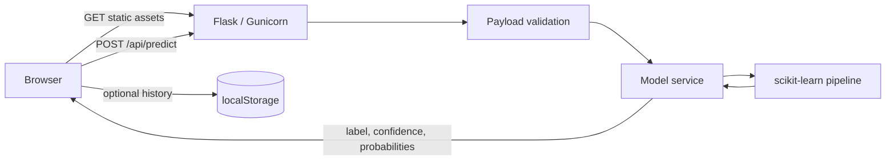

# Architecture

MindCare is a stateless full-stack application. React handles presentation and
device-local history; Flask validates inputs and invokes a serialized
scikit-learn pipeline. Production uses one container and one origin.

## Boundaries

### Frontend

- `src/app`: routing and application shell.
- `src/components`: reusable layout, assessment, and UI primitives.
- `src/pages`: route-level components, lazy-loaded by the router.
- `src/providers`: cross-application React providers.
- `src/lib`: domain constants and browser persistence helpers.
- `src/styles`: Tailwind entry point and semantic theme tokens.

### Backend

- `mindcare/__init__.py`: Flask application factory.
- `mindcare/routes.py`: HTTP endpoints and SPA fallback.
- `mindcare/schema.py`: input contract and normalization.
- `mindcare/inference.py`: model loading and prediction response.
- `mindcare/config.py`: paths and environment defaults.
- `app.py`: local development and Gunicorn compatibility entry point.

## Data and privacy

The API is stateless and does not write assessment data to disk. Browser
history is optional and remains in local storage on the user's device. The raw
training dataset and notebooks are excluded from the runtime image.

## Model artifacts

Artifacts are loaded in this order:

1. `mental_health_model_production.pkl`
2. `mental_health_model_ensemble_soft.pkl`
3. `mental_health_model_ensemble_hard.pkl`
4. `mental_health_model.pkl`

The current repository falls back to the soft-voting ensemble.

## Security posture

- Numeric inputs are restricted to the training ranges.
- CORS is allowlisted for split local development.
- Production is same-origin and runs as an unprivileged container user.
- The Compose profile drops Linux capabilities and uses a read-only root filesystem.
- Unexpected prediction exceptions are logged server-side without exposing internals.